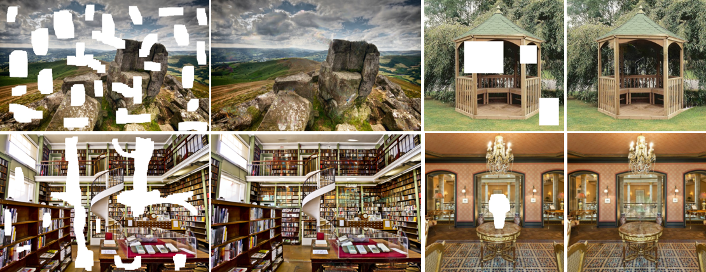

# [Globally and Locally Consistent Image Completion](http://hi.cs.waseda.ac.jp/~iizuka/projects/completion/)

[Satoshi Iizuka](http://hi.cs.waseda.ac.jp/~iizuka/index_eng.html), [Edgar Simo-Serra](http://hi.cs.waseda.ac.jp/~esimo/), [Hiroshi Ishikawa](http://www.f.waseda.jp/hfs/indexE.html)



## Overview

This code provides an implementation of the research paper:

```
  "Globally and Locally Consistent Image Completion"
  Satoshi Iizuka, Edgar Simo-Serra, and Hiroshi Ishikawa
  ACM Transaction on Graphics (Proc. of SIGGRAPH 2017), 2017
```
We learn to inpaint missing regions with a deep convolutional network.
Our network completes images of arbitrary resolutions by filling in
missing regions of any shape. We use global and local context discriminators
to train the completion network to provide both locally and globally consistent results.
See our [project page](http://hi.cs.waseda.ac.jp/~iizuka/projects/completion/) for more detailed information.

## License

```
  Copyright (C) <2017> <Satoshi Iizuka, Edgar Simo-Serra, Hiroshi Ishikawa>

  This work is licensed under the Creative Commons
  Attribution-NonCommercial-ShareAlike 4.0 International License. To view a copy
  of this license, visit http://creativecommons.org/licenses/by-nc-sa/4.0/ or
  send a letter to Creative Commons, PO Box 1866, Mountain View, CA 94042, USA.

  Satoshi Iizuka, Waseda University
  iizuka@aoni.waseda.jp, http://hi.cs.waseda.ac.jp/~iizuka/index_eng.html
  
  Edgar Simo-Serra, Waseda University
  esimo@aoni.waseda.jp, http://hi.cs.waseda.ac.jp/~esimo/
```


## Dependencies

- [Torch7](http://torch.ch/docs/getting-started.html)
- [nn](https://github.com/torch/nn)
- [image](https://github.com/torch/image)
- [nngraph](https://github.com/torch/nngraph)
- [torch-opencv](https://github.com/VisionLabs/torch-opencv) (optional, but required for post-processing)

The packages of `nn`, `image`, and `nngraph` should be a part of a standard Torch7 install.
For information on how to install Torch7 please see the [official torch documentation](http://torch.ch/docs/getting-started.html)
on the subject. The `torch-opencv` is OpenCV bindings for LuaJit+Torch, which can be installed via 
`luarocks install cv` after installing OpenCV 3.1. Please see the [instruction page](https://github.com/VisionLabs/torch-opencv/wiki/Installation) for more detailed information.

## Usage

First, download the model by running the download script:

```
bash download_model.sh
```

Basic usage is:

```
th inpaint.lua --input <input_image> --mask <mask_image>
```
The mask is a binary image (1 for pixels to be completed, 0 otherwise) and should be the same size as the input image.

Other options:

- `--gpu`: Use GPU for the computation. [cunn](https://github.com/torch/cunn) is required to use this option. Defaults to false.
- `--maxdim`: Long edge dimension of the input image. Defaults to 500.
- `--nopostproc`: Disable the post-processing. Defaults to false. If you fail to install the `torch-opencv`, use this option to avoid using the package.

For example:

```
th inpaint.lua --input example.png --mask example_mask.png
```

### Best Performance

- This model was trained on the [Places2 dataset](http://places2.csail.mit.edu/) and thus best performance is for natural outdoor images.
- While the model works on images of any size with arbitrary holes, we trained it on images with the smallest edges in the [256, 384] pixel range and random holes in the [96, 128] pixel range. Our model will work best
on images with holes of those sizes.
- Significantly large holes or extrapolation when the holes are at the border of images may fail to be filled in due to limited spatial support of the model.

### Notes

- This is developed on a Linux machine running Ubuntu 16.04 during late 2016.
- Provided model and sample code is under a non-commercial creative commons license.

## Citing

If you use this code please cite:

```
@Article{IizukaSIGGRAPH2017,
  author = {Satoshi Iizuka and Edgar Simo-Serra and Hiroshi Ishikawa},
  title = {{Globally and Locally Consistent Image Completion}},
  journal = "ACM Transactions on Graphics (Proc. of SIGGRAPH)",
  year = 2017,
  volume = 36,
  number = 4,
  pages = 107:1--107:14,
  articleno = 107,
}
```


